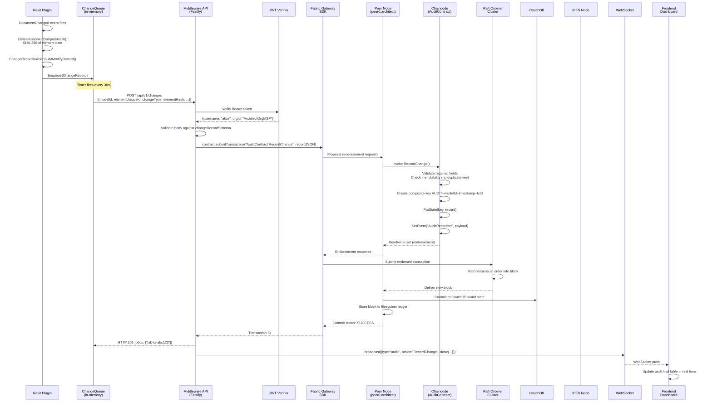
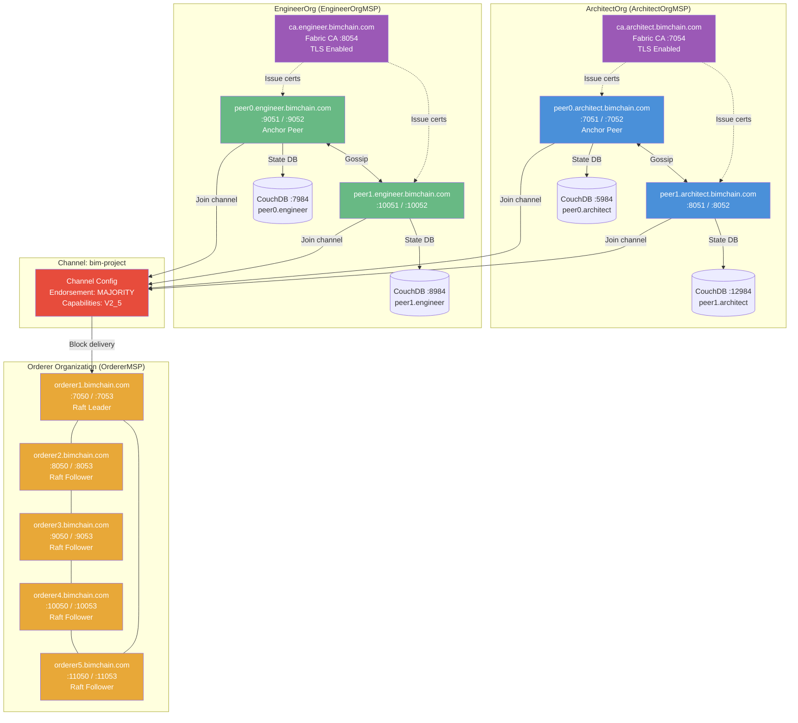
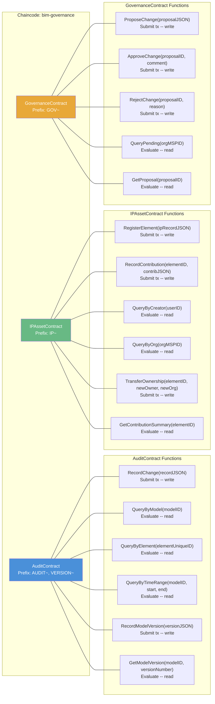
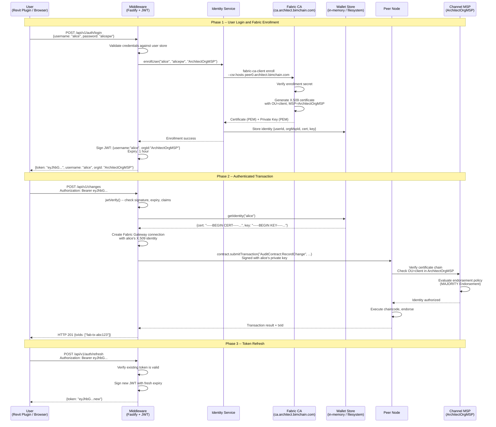
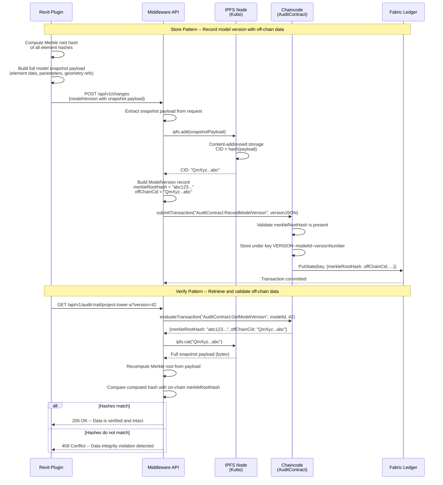

# BIM-Chain Architecture

This document describes the overall system architecture of the BIM-Chain platform -- a Hyperledger Fabric-based governance layer for Building Information Modeling (BIM) workflows. It covers the layered system overview, end-to-end data flows, network topology, chaincode interactions, identity management, and off-chain storage patterns.

---

## 1. System Overview

BIM-Chain is organized into five layers. Design tool plugins capture element changes, the API gateway validates and routes requests, the Fabric blockchain network provides the immutable ledger, state databases and IPFS handle storage, and a web dashboard surfaces the data to project stakeholders.

```mermaid
graph TB
    subgraph "Layer 1 -- Client (Design Tools)"
        RP[Revit Plugin<br/>.NET 8 / C#]
        OTHER[Future Plugins<br/>ArchiCAD, Navisworks]
    end

    subgraph "Layer 2 -- API Gateway"
        MW[Middleware<br/>Node.js / Fastify]
        AUTH[JWT Authentication<br/>fast-jwt]
        VAL[Schema Validation<br/>Ajv]
        WS[WebSocket Service<br/>Real-time events]
        IDSVC[Identity Service<br/>Fabric CA enrollment]
    end

    subgraph "Layer 3 -- Blockchain Network"
        direction TB
        ORD[Raft Orderer Cluster<br/>5 nodes]
        PA0[peer0.architect]
        PA1[peer1.architect]
        PE0[peer0.engineer]
        PE1[peer1.engineer]
        CC_AUDIT[AuditContract]
        CC_IP[IPAssetContract]
        CC_GOV[GovernanceContract]
    end

    subgraph "Layer 4 -- Storage"
        COUCH_A0[(CouchDB<br/>peer0.architect)]
        COUCH_A1[(CouchDB<br/>peer1.architect)]
        COUCH_E0[(CouchDB<br/>peer0.engineer)]
        COUCH_E1[(CouchDB<br/>peer1.engineer)]
        IPFS[(IPFS<br/>Off-chain data)]
        LEDGER[(Immutable Ledger<br/>Block files)]
    end

    subgraph "Layer 5 -- Presentation"
        FE[Frontend Dashboard<br/>Next.js / React]
        API_DOCS[REST API<br/>/api/v1/*]
    end

    RP -->|HTTPS POST /api/v1/changes| MW
    OTHER -.->|Future integration| MW
    MW --- AUTH
    MW --- VAL
    MW --- WS
    MW --- IDSVC
    IDSVC -->|Enroll/Register| CA_A[CA Architect]
    IDSVC -->|Enroll/Register| CA_E[CA Engineer]

    MW -->|gRPC + Fabric Gateway SDK| PA0
    MW -->|gRPC + Fabric Gateway SDK| PE0

    PA0 --- CC_AUDIT
    PA0 --- CC_IP
    PA0 --- CC_GOV
    PE0 --- CC_AUDIT
    PE0 --- CC_IP
    PE0 --- CC_GOV

    PA0 & PA1 & PE0 & PE1 -->|Transaction ordering| ORD

    PA0 -->|World state| COUCH_A0
    PA1 -->|World state| COUCH_A1
    PE0 -->|World state| COUCH_E0
    PE1 -->|World state| COUCH_E1
    PA0 & PA1 & PE0 & PE1 -->|Block storage| LEDGER

    MW -->|Store/Retrieve CID| IPFS

    FE -->|REST + JWT| MW
    MW -->|Push events| WS
    WS -->|Real-time updates| FE
    FE --- API_DOCS

    style RP fill:#4A90D9,color:#fff
    style OTHER fill:#4A90D9,color:#fff,stroke-dasharray: 5 5
    style MW fill:#68B984,color:#fff
    style AUTH fill:#68B984,color:#fff
    style VAL fill:#68B984,color:#fff
    style WS fill:#68B984,color:#fff
    style IDSVC fill:#68B984,color:#fff
    style FE fill:#E74C3C,color:#fff
    style ORD fill:#E8A838,color:#fff
    style PA0 fill:#4A90D9,color:#fff
    style PA1 fill:#4A90D9,color:#fff
    style PE0 fill:#68B984,color:#fff
    style PE1 fill:#68B984,color:#fff
    style IPFS fill:#9B59B6,color:#fff
```



### Layer Summary

| Layer | Technology | Responsibility |
|-------|-----------|----------------|
| Client | C# / .NET 8, Revit API | Detect element changes, compute SHA-256 hashes, queue and submit records |
| API Gateway | Node.js 20, Fastify, fast-jwt | JWT auth, request validation, Fabric SDK bridge, WebSocket events |
| Blockchain | Hyperledger Fabric 2.5, Go 1.21 | Immutable ledger, smart contract execution, consensus, endorsement |
| Storage | CouchDB 3.3, IPFS (Kubo) | World state queries (CouchDB), off-chain BIM data (IPFS), block files |
| Presentation | Next.js 14, React, TailwindCSS | Audit trail viewer, IP attribution dashboard, governance workflow UI |

---

## 2. Data Flow

The following sequence diagram traces a single BIM element modification from the Revit desktop application through the entire BIM-Chain pipeline, ending with a real-time dashboard update.



### Batch Flow

The Revit plugin supports batch submission. The `ChangeQueue` collects individual `ChangeRecord` objects and the `SyncHandler` flushes them as an array to `POST /api/v1/changes`. The middleware iterates the array and submits each record as a separate Fabric transaction, returning all transaction IDs in a single response.

### Model Version Flow

On Revit "Synchronize with Central" events, the plugin additionally computes a Merkle root hash of all tracked element hashes and submits a `ModelVersion` record via `AuditContract:RecordModelVersion`. If the full model snapshot is large, the snapshot payload is stored in IPFS and only the CID is stored on-chain in the `offChainCid` field.

---

## 3. Fabric Network Topology

The BIM-Chain network consists of two peer organizations (ArchitectOrg and EngineerOrg), each with two peer nodes backed by CouchDB, five Raft orderer nodes for crash fault tolerance, and two Fabric Certificate Authorities. All nodes communicate over mutual TLS.



### Network Details

| Component | Count | Image | Notes |
|-----------|-------|-------|-------|
| Raft Orderers | 5 | `hyperledger/fabric-orderer:2.5` | Tolerates 2 simultaneous failures (5 = 2f+1) |
| ArchitectOrg Peers | 2 | `hyperledger/fabric-peer:2.5` | peer0 is the anchor peer for cross-org gossip |
| EngineerOrg Peers | 2 | `hyperledger/fabric-peer:2.5` | peer0 is the anchor peer for cross-org gossip |
| CouchDB Instances | 4 | `couchdb:3.3` | One per peer, credentials: `bimadmin`/`bimadminpw` |
| Fabric CAs | 2 | `hyperledger/fabric-ca:1.5` | One per peer org, TLS enabled, bootstrap admin: `admin`/`adminpw` |
| Channel | 1 | -- | `bim-project`, uses channel participation API (no system channel) |
| Chaincode | 1 | -- | `bim-governance`, contains AuditContract + IPAssetContract + GovernanceContract |

### Consensus Configuration (from configtx.yaml)

- **Orderer type**: `etcdraft`
- **Batch timeout**: 2 seconds
- **Max message count**: 10 per block
- **Absolute max bytes**: 99 MB
- **Preferred max bytes**: 512 KB
- **Endorsement policy**: `MAJORITY Endorsement` (both orgs must endorse)
- **Lifecycle endorsement**: `MAJORITY Endorsement`

---

## 4. Chaincode Interaction

The `bim-governance` chaincode bundles three smart contracts into a single deployment unit. Each contract manages a distinct domain and stores data under its own composite key prefix.



### Composite Key Schema

| Contract | Prefix | Key Format | Example |
|----------|--------|-----------|---------|
| AuditContract | `AUDIT` | `AUDIT~{modelId}~{timestamp}~{txId}` | `AUDIT~project-tower-a~2025-06-15T10:30:00.000Z~fab-tx-abc123` |
| AuditContract | `VERSION` | `VERSION~{modelId}~{versionNumber}` | `VERSION~project-tower-a~42` |
| IPAssetContract | `IP` | `IP~{elementUniqueId}` | `IP~wall-001-ext` |
| GovernanceContract | `GOV` | `GOV~{proposalId}` | `GOV~prop-2025-001` |

### Chaincode Events

| Event Name | Emitted By | Payload Fields |
|-----------|-----------|----------------|
| `AuditRecorded` | `AuditContract.RecordChange` | `modelId`, `elementUniqueId`, `changeType`, `txId` |

### Chaincode-as-a-Service (CCAAS)

The chaincode supports running as an external service when the `CHAINCODE_ID` and `CHAINCODE_SERVER_ADDRESS` environment variables are set. In CCAAS mode, the chaincode starts a gRPC server that the peer connects to, rather than the peer launching the chaincode in a Docker container. This is the recommended approach for Kubernetes deployments.

---

## 5. Identity Management Flow

BIM-Chain uses a two-tier identity model: JWT tokens authenticate users at the REST API layer, while X.509 certificates issued by Fabric CAs authorize transactions on the blockchain network. The middleware bridges these two worlds by mapping API users to enrolled Fabric identities.



### Identity Layers

| Layer | Mechanism | Implementation | Purpose |
|-------|-----------|----------------|---------|
| API Authentication | JWT (fast-jwt via @fastify/jwt) | `app.register(fjwt, { secret })` | Stateless request authentication at the REST API boundary |
| Fabric Identity | X.509 Certificates (ECDSA P-256) | `FabricServiceImpl.connect()` | Transaction signing for endorsement proposals |
| Organization MSP | Membership Service Provider | `configtx.yaml` org definitions | Defines organizational boundaries and trust roots |
| Channel Policy | Endorsement Policies | `MAJORITY Endorsement` | Requires endorsement from a majority of member orgs |
| Attribute-Based Access Control (ABAC) | Certificate attributes / OUs | `EnableNodeOUs: true` in crypto-config | Distinguishes admin, peer, client, and orderer roles within each org |

### Access Control Matrix

| Role | Audit Read | Audit Write | IP Read | IP Write | IP Transfer | Governance Propose | Governance Vote |
|------|-----------|-------------|---------|----------|-------------|-------------------|-----------------|
| Admin (OU=admin) | Yes | Yes | Yes | Yes | Yes | Yes | Yes |
| Client (OU=client) | Yes | Yes | Yes | Own org elements | No | Yes | Yes (if in requiredOrgs) |
| Peer (OU=peer) | Yes | No (system only) | Yes | No | No | No | No |

### MSP Structure

Each organization's MSP directory follows the standard Fabric layout:

```
peerOrganizations/architect.bimchain.com/msp/
  cacerts/             # Root CA certificate
  tlscacerts/          # TLS CA certificate
  admincerts/          # Admin certificates
  config.yaml          # NodeOUs configuration (Enable: true)
```

With `EnableNodeOUs: true`, the CA embeds organizational unit (OU) attributes into certificates, allowing the MSP to distinguish between `admin`, `peer`, `client`, and `orderer` roles without maintaining separate admincerts directories.

---

## 6. Off-chain Storage Pattern

BIM models can contain thousands of elements, and storing full model snapshots on the blockchain ledger is impractical. BIM-Chain uses an off-chain storage pattern where the cryptographic hash of the data is recorded on-chain for tamper-evidence, while the full data payload is stored in IPFS for retrieval.



### How It Works

1. **Content Addressing**: IPFS generates a Content Identifier (CID) from the SHA-256 hash of the stored data. This means the CID itself is a cryptographic commitment to the data contents -- any modification to the data would produce a different CID.

2. **On-chain Anchor**: The `ModelVersion` record stored on the Fabric ledger contains:
   - `merkleRootHash` -- The Merkle root of all individual element hashes at that point in time
   - `offChainCid` -- The IPFS CID pointing to the full model snapshot
   - `previousHash` -- The hash of the prior version, forming a hash chain

3. **Verification**: To verify data integrity, the middleware retrieves the off-chain payload from IPFS, recomputes the Merkle root from the payload's element hashes, and compares it with the on-chain `merkleRootHash`. A mismatch indicates the off-chain data has been tampered with.

4. **Immutability Guarantee**: Because both the on-chain record and the IPFS CID are content-addressed, neither can be altered without detection. The Fabric ledger ensures the on-chain record cannot be changed, and IPFS ensures the off-chain data matches its CID.

### Storage Decision Matrix

| Data Type | Storage Location | Reason |
|-----------|-----------------|--------|
| Audit trail records (individual changes) | On-chain (Fabric ledger + CouchDB) | Small records (~1 KB), need rich queries |
| IP attribution records | On-chain | Small records, need ownership queries |
| Governance proposals | On-chain | Small records, need status queries |
| Model version metadata | On-chain | Hash anchors (~200 bytes), need version queries |
| Full model snapshots | Off-chain (IPFS) | Large payloads (MBs), content-addressed |
| Element geometry data | Off-chain (IPFS) | Large binary data, referenced by CID |
| Rendered thumbnails | Off-chain (IPFS) | Binary data, not needed for verification |

### IPFS Configuration

The IPFS node runs as a Docker service using the `ipfs/kubo:latest` image with the following ports:

| Port | Protocol | Purpose |
|------|----------|---------|
| 4001 | TCP | Swarm / peer-to-peer communication |
| 5001 | HTTP | API endpoint (used by middleware) |
| 8080 | HTTP | Gateway for content retrieval |

In production, the IPFS node should be configured with:
- **Private network**: Use a swarm key to restrict the IPFS network to trusted nodes
- **Pinning**: Pin all CIDs referenced by on-chain records to prevent garbage collection
- **Replication**: Run multiple IPFS nodes across organizations for data redundancy
- **Access control**: Restrict the API port (5001) to the middleware service only
